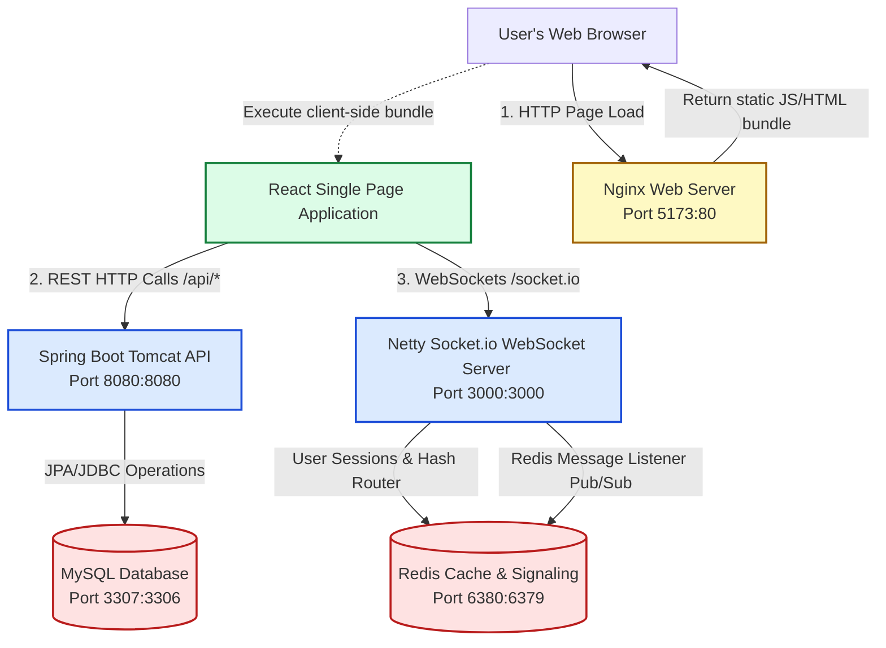
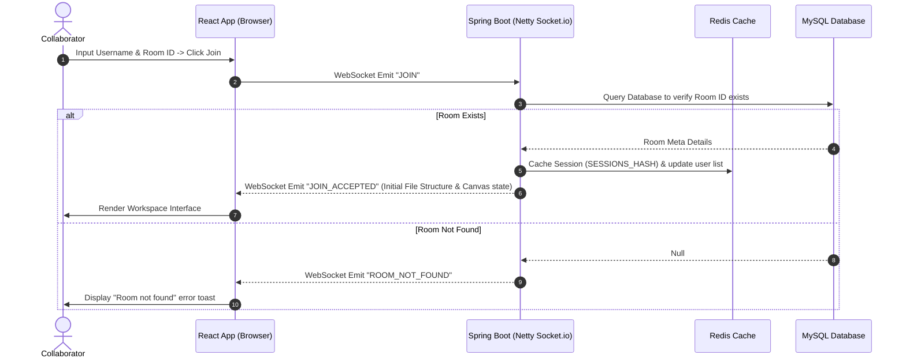
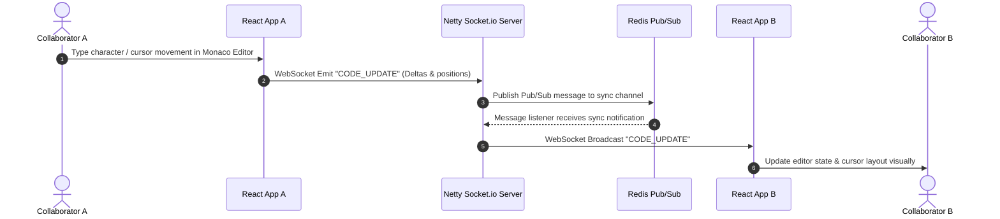

# CodeSync - Real-Time Collaborative Coding Platform

CodeSync is a real-time collaborative development platform that allows multiple developers to edit code, message each other, execute programs in a sandbox environment, and draw together on a shared canvas.

---

## 🚀 Key Features

* **Real-time Code Editing:** Multi-user collaborative text editing with position sync, active selection highlights, and user cursors powered by Monaco Editor.
* **Shared Drawing Board:** A synced canvas whiteboard for diagrams, brainstorming, and wireframes.
* **Instant Messaging:** Multi-room chat panels for developer communication.
* **File Directory Workspace:** Synchronized, nested file tree with rename, delete, and file tab controls.
* **Database & Caching Administration:** Embedded web-based panels for browsing databases (phpMyAdmin) and cache keys (Redis Commander).
* **Docker Containerized Deployment:** Simple orchestrations with multi-stage builds and production-grade Nginx configurations.

---

## 🏗️ System Architecture

CodeSync utilizes a decoupled frontend and backend containerized microservice design:



---

## 🔄 Real-Time Dataflow Diagrams

### A. Joining a Room (Connection Sync)
When a user joins a room, the application queries MySQL to ensure the room exists, saves the session state to Redis, and broadcasts the current file structure and drawing state back to the user:



### B. Real-Time Editor Synchronization (Coding Flow)
When user actions occur in the Monaco Editor, code deltas are instantly shared with all other room members using Socket.io and Redis pub/sub replication:



---

## 📂 Project Directory Structure

```text
code-sync-real-time/
├── client/                 # React (TypeScript/Vite) Frontend Application
│   ├── src/                # Components, Contexts, Hooks, Styles, Types
│   ├── Dockerfile          # Multi-stage Docker build config (Node -> Nginx)
│   ├── nginx.conf          # Nginx routing rules for React Router SPA
│   └── package.json        # Frontend dependencies
│
├── server/                 # Spring Boot (Java) Backend API & WebSocket Server
│   ├── src/                # Spring Boot configuration, controllers, repositories
│   ├── Dockerfile          # Multi-stage Maven JRE build config
│   └── pom.xml             # Backend dependencies
│
├── docker-compose.yml      # Orchestration file for full application stack
└── README.md               # Root documentation
```

---

## 🛠️ Getting Started (Local Run)

### Option 1: Docker Compose (Quickest)
Prerequisites: **Docker Desktop** installed.

1. Clone the project and navigate to the root folder.
2. Build and run the entire stack in detached mode:
   ```bash
   docker compose up -d --build
   ```
3. Open your browser and access the services:
   * **Web Frontend:** [http://localhost:5173](http://localhost:5173)
   * **Database Manager (phpMyAdmin):** [http://localhost:8081](http://localhost:8081)
   * **Redis Cache Manager (Redis Commander):** [http://localhost:8082](http://localhost:8082)

---

### Option 2: Running Manually (Without Docker)

#### Prerequisites
* **Java Development Kit (JDK) 21** or higher.
* **Node.js v18** or higher.
* Running **MySQL** database on port `3306`.
* Running **Redis** cache on port `6379`.

#### Setup Databases
1. Create a MySQL database named `codesync`:
   ```sql
   CREATE DATABASE codesync;
   ```

#### Start Backend Server
1. Navigate to the server folder:
   ```bash
   cd server
   ```
2. Build and run the backend:
   ```bash
   mvn spring-boot:run
   ```
   *The server APIs will boot on port `8080` and the WebSocket server on port `3000`.*

#### Start Frontend Client
1. Navigate to the client folder:
   ```bash
   cd ../client
   ```
2. Install dependencies:
   ```bash
   npm install
   ```
3. Start the development server:
   ```bash
   npm run dev
   ```
   *The client app will open on [http://localhost:5173](http://localhost:5173).*
