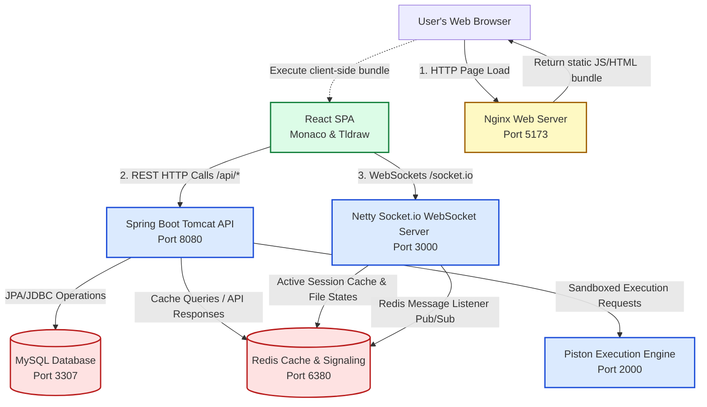
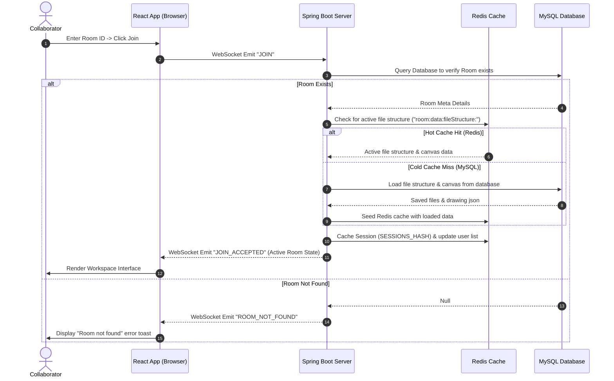
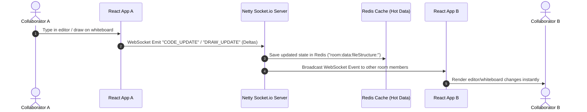
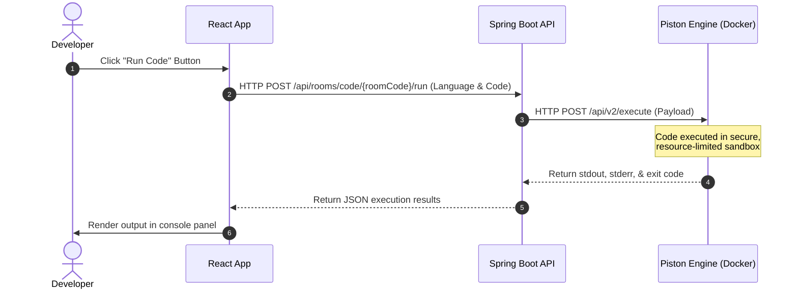
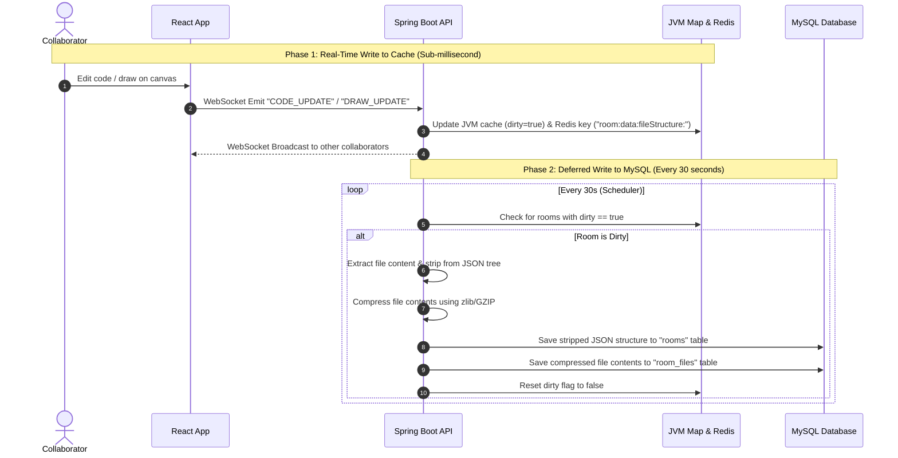

# CodeSync - Real-Time Collaborative Coding Platform

CodeSync is a real-time collaborative development platform that enables multiple developers to write code, execute programs in a sandboxed environment, message each other, and draw on a shared canvas.

---

## 🚀 Key Features

* **Collaborative Text Editor:** Multi-user editing with Monaco Editor, including active cursor synchronization, selection highlights, and collaborator presence.
* **Shared Drawing Board:** Synced vector whiteboard powered by Tldraw for system diagrams, brainstorming, and wireframes.
* **Sandboxed Code Execution:** Secure, resource-limited code execution using an integrated Piston microservice supporting Node.js, Python, Java, Go, Rust, Ruby, C++, TypeScript, and other languages.
* **Real-Time Collaboration Panel:** Built-in chat panels for multi-room communication.
* **File Directory Workspace:** Synchronized, nested file tree with rename, delete, tab state management, and file creation controls.
* **Dual-Layer Caching & Persistence:** Sub-millisecond response times using Redis for active session caching and hot data, with periodic flushing to MySQL for durable snapshot storage.
* **Embedded Operations Panels:** Built-in phpMyAdmin and Redis Commander interfaces for easy database and cache inspection during development.

---

## 🏗️ System Architecture

CodeSync utilizes a decoupled frontend and backend containerized microservice design:



---

## 🔄 Real-Time Dataflow Diagrams

### A. Joining a Room (Dual-Layer Sync)
When a collaborator joins a room, the application verifies the room in the database, caches their session state in Redis, and loads the active code files and canvas coordinates directly from **Redis hot storage** rather than MySQL to minimize database overhead. If the cache is cold, it loads from MySQL and seeds the Redis cache.



### B. Real-Time Collaboration (Editor & Canvas Sync)
Monaco Editor deltas, collaborator cursors, and whiteboard drawings are synced in real-time. Socket.io broadcasts these deltas immediately to other users in the room, while backing up the changes to Redis.



### C. Sandboxed Code Execution Flow
Users can run their code inside a secure environment. The execution is handled by the containerized Piston engine:



---

## 💾 Caching & Persistence Strategy

CodeSync uses a **Write-Back (Write-Behind) Caching Pattern** to combine the performance of memory with the durability of a relational database:

1. **Active Editing (Hot Data)**: All real-time changes to the file tree, active editor tabs, and drawing canvas are written directly to **Redis**. This keeps synchronization delays under **1ms**.
2. **Query Caching**: Dashboard room lists and metadata validation are cached via Spring Cache (Redis) using a custom ObjectMapper configured with `JavaTimeModule` for fast query performance (under **50ms**).
3. **Snapshot Flushing (Cold Storage)**: A scheduled background service running in the Spring Boot container periodically flushes dirty (modified) room states from Redis back to **MySQL** every 30 seconds.
4. **Shutdown Protection**: The Spring Boot application catches shutdown signals (`PreDestroy`) to force-flush all pending memory/Redis snapshots to MySQL before stopping.

### 🔄 Detailed Write-Back (Write-Behind) Caching Flow

To prevent database bottlenecks caused by constant keystrokes and drawing actions, the application decouples client-side updates from database persistence:



#### 1. Phase 1: Real-Time Write to Cache (Hot Path)
* **Immediate Updates**: When a collaborator types code or updates the drawing canvas, the React client sends a WebSocket payload containing the delta.
* **Double-Layer Cache Write**: The Netty Socket.io server routes this payload to `RoomDataCacheService`, which:
  1. Updates an in-memory JVM cache (`ConcurrentHashMap`) so the server has instant, local access.
  2. Sets a `dirty = true` flag on that room's cached representation.
  3. Writes the updated JSON structure immediately to **Redis** under the key `room:data:fileStructure:<roomCode>` or `room:data:drawingData:<roomCode>`.
* **Latency**: Because this process only involves memory and Redis, the entire write cycle is completed in **under 1ms**, enabling seamless real-time collaboration.

#### 2. Phase 2: Deferred Write to MySQL (Cold Path)
* **The Scheduler**: A Spring background scheduler running every 30 seconds (configured via `app.cache.flush-interval-ms` in `application.properties`) executes `flushDirtyRooms()`.
* **Dirty State Scan**: The scheduler iterates through the room cache. If a room's `dirty` flag is `false`, it is skipped. If `true`, the `persistRoom()` method is invoked.
* **Database Optimization (Data Splitting & Compression)**:
  * **Stripping Metadata**: Saving the full JSON tree (with large text files) inside a single database cell is inefficient. Therefore, the service parses the JSON tree, extracts the text contents of every file, and **removes the `"content"` fields** from the JSON.
  * **Saving Structure**: The clean, stripped JSON tree (representing only the directory structure, file names, and IDs) is saved to the `rooms` table under the `file_structure_json` column.
  * **Saving Content**: The actual file contents are **compressed** into binary blobs using `zlib` (via `CompressionUtils.compress()`) to minimize database storage space. These compressed blobs are saved to the `room_files` table, mapped by `room_id` and `file_id`.
  * **Reset Flag**: Once the database transaction successfully commits, the room's `dirty` flag is reset to `false`.

#### 3. Read Flow (Reconstruction on Cache Miss)
* When a user joins a room, `RoomDataCacheService.getOrLoad(roomCode)` is called:
  1. **Redis Cache Hit**: The service attempts to load from Redis first. If found, it returns the cached data immediately.
  2. **MySQL Fallback (Cache Miss)**: If Redis is cold, it loads the stripped JSON structure from the `rooms` table and the compressed file contents from the `room_files` table.
  3. **Reconstruction**: It decompresses the file contents, injects them back into the corresponding file nodes in the JSON structure, seeds the fully reconstructed JSON into Redis, and returns it.

---

## 📂 Project Directory Structure

```text
code-sync-real-time/
├── client/                 # React (TypeScript/Vite) Frontend
│   ├── src/
│   │   ├── api/            # Axios API client & endpoints
│   │   ├── components/     # UI, Sidebar, Monaco, & Whiteboard components
│   │   ├── context/        # Auth, Socket, Copilot, & RunCode contexts
│   │   ├── pages/          # Login, Register, & Dashboard pages
│   │   └── styles/         # CSS design tokens & global overrides
│   ├── Dockerfile          # Multi-stage build (Node -> Nginx)
│   ├── nginx.conf          # Nginx routing rules for React Router SPA
│   └── package.json        # Frontend packages
│
├── server/                 # Spring Boot (Java 21) Backend & WebSockets
│   ├── src/
│   │   └── main/java/com/codesync/
│   │       ├── config/     # Security, Redis Cache, & SocketIO config
│   │       ├── controller/ # REST Controllers (Auth, Rooms, Run)
│   │       ├── entity/     # JPA Hibernate Entities (User, Room)
│   │       ├── repository/ # Spring Data JPA Repositories
│   │       ├── security/   # JWT verification & UserDetailsService
│   │       ├── service/    # Room, UserSession, & RoomDataCache services
│   │       └── socket/     # SocketIO event handlers & connection listeners
│   ├── Dockerfile          # Multi-stage build (Maven -> Eclipse Temurin JRE)
│   └── pom.xml             # Maven dependencies & build plugins
│
├── docker-compose.yml      # Container orchestration configuration
└── README.md               # Root documentation
```

---

## 🛠️ Getting Started (Local Run)

### Option 1: Docker Compose (Recommended)
Prerequisites: **Docker Desktop** installed.

1. Clone the repository and navigate to the root directory.
2. Build and start the entire containerized stack:
   ```bash
   docker compose up -d --build
   ```
3. Once the containers are running, access the services:
   * **Web Application:** [http://localhost:5173](http://localhost:5173)
   * **Database Manager (phpMyAdmin):** [http://localhost:8081](http://localhost:8081)
   * **Redis Inspector (Redis Commander):** [http://localhost:8082](http://localhost:8082)

---

### Option 2: Running Manually (Development Mode)

#### Prerequisites
* **Java Development Kit (JDK) 21**
* **Node.js v18+**
* Running **MySQL** instance on port `3306` (or mapping `3307`).
* Running **Redis** instance on port `6379` (or mapping `6380`).

#### Step 1: Prepare the Database
Create a MySQL database named `codesync`:
```sql
CREATE DATABASE codesync;
```

#### Step 2: Start the Backend API & Socket Server
1. Navigate to the server directory:
   ```bash
   cd server
   ```
2. Configure your database credentials in `src/main/resources/application.properties`.
3. Compile and start the Spring Boot application:
   ```bash
   mvn spring-boot:run
   ```
   *The REST API will start on port `8080` and the WebSocket server on port `3000`.*

#### Step 3: Start the Frontend Client
1. Navigate to the client directory:
   ```bash
   cd ../client
   ```
2. Install the node modules:
   ```bash
   npm install
   ```
3. Start the Vite dev server:
   ```bash
   npm run dev
   ```
   *The web application will open on [http://localhost:5173](http://localhost:5173).*
